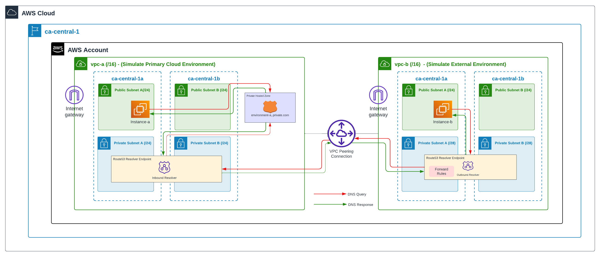

# Proof-of-concept for Route53 Endpoint Resolvers

## Objective

This POC aims to deploy two VPCs in order to test route53 inbound and outbound concepts.



### Environment A:

- VPC-A is created to simulate client primary cloud environment.
- A Private hosted zone "environment-a.private.com" is deployed here with a record called "google.environment-a.private.com".
- A route53 inbound resolver endpoint "environment-a-inbound" is deployed on VPC-A private subnets.
- This endpoint has only private IPs, so only connections that can reach them are able to resolve DNS queries.
- A EC2 instance is deployed on this VPC public-subnet.

### Environment B:

- VPC-B is created to simulate client external environment.
- A EC2 instance is deployed on this VPC public subnet.
- In this environment in order to resolve entries from  "environment-a.private.com"  Private Zone we start by `manually` configuring DNS to query IPs from environment A's inbound resolver endpoint. This allows us to test connectivity between environments.
- Once connectivity is tested, we can deploy output endpoint and a forward rule for "environment-a.private.com" domain.

## Deploy terraform

```bash
terraform init
terraform apply -auto-approve -var=use_output_endpoint=false
```
## Test DNS resolution first time

Run the test script:

```bash
./test_dns.sh
```

Result should be similar to the following:
```yaml
./test_dns.sh
====================================================
Test DNS resolution from Environment A
====================================================
$ nslookup google.environment-a.private.com
Server:         127.0.0.53
Address:        127.0.0.53#53

Non-authoritative answer:
google.environment-a.private.com        canonical name = www.google.com.
Name:   www.google.com
Address: 172.217.13.164
Name:   www.google.com
Address: 2607:f8b0:4020:807::2004

$ nslookup google.environment-a.private.com 10.78.100.10
Server:         10.78.100.10
Address:        10.78.100.10#53

Non-authoritative answer:
google.environment-a.private.com        canonical name = www.google.com.
Name:   www.google.com
Address: 172.217.13.196
Name:   www.google.com
Address: 2607:f8b0:4020:807::2004

====================================================
Test DNS resolution from Environment B
====================================================
$ nslookup google.environment-a.private.com
Server:         127.0.0.53
Address:        127.0.0.53#53

** server can't find google.environment-a.private.com: NXDOMAIN

$ nslookup google.environment-a.private.com 10.78.100.10
Server:         10.78.100.10
Address:        10.78.100.10#53

Non-authoritative answer:
google.environment-a.private.com        canonical name = www.google.com.
Name:   www.google.com
Address: 172.217.13.196
Name:   www.google.com
Address: 2607:f8b0:4020:806::2004
```
As you can see, DNS resolution from Environment B doesn't work without explicitly specifying the IP Address of DNS Inbound:

```bash
nslookup google.environment-a.private.com              # It doesn't work, because it queries VPC-B DNS only and they are unaware of this domain
nslookup google.environment-a.private.com 10.78.100.10 # It works, because it queries VPC-A inbound resolver IP directly
```

This would be the equivalent of a onPremises environment DNS that needs to have a `Forward DNS` rule for a given domain in order to query the right inbound endpoint on AWS.

## Deploy the outbound resolver on VPC-B

By specifying the parameter `use_output_endpoint` as true (default) we deploy un outbound resolver on VPC-B, with a forward rule to VPC-A:

```bash
terraform init
terraform apply -auto-approve -var=use_output_endpoint=true
```

## Test DNS resolution a second time

Run the test script:

```bash
./test_dns.sh
```

With the outbound rule configured, there's not `extra` step that needs to be done on VPC-B instances, all querys of the domain are forward to VPC-A inbound endpoint:

```yaml
====================================================
Test DNS resolution from Environment A
====================================================
# The same as before  (...)

====================================================
Test DNS resolution from Environment B
====================================================
$ nslookup google.environment-a.private.com
Warning: Permanently added 'ec2-YYYYYYYYY.ca-central-1.compute.amazonaws.com' (ED25519) to the list of known hosts.
Server:         127.0.0.53
Address:        127.0.0.53#53

Non-authoritative answer:
google.environment-a.private.com        canonical name = www.google.com.
Name:   www.google.com
Address: 172.217.13.100
Name:   www.google.com
Address: 2607:f8b0:4020:806::2004

$ nslookup google.environment-a.private.com 10.78.100.10
Server:         10.78.100.10
Address:        10.78.100.10#53

Non-authoritative answer:
google.environment-a.private.com        canonical name = www.google.com.
Name:   www.google.com
Address: 172.217.13.196
Name:   www.google.com
Address: 2607:f8b0:4020:806::2004
```

In summary:

```bash
nslookup google.environment-a.private.com              # It works now, because there's an outbound resolver that forwards queries to VPC-A inbound resolver
nslookup google.environment-a.private.com 10.78.100.10 # It works, because it queries VPC-A inbound resolver IP directly
```
